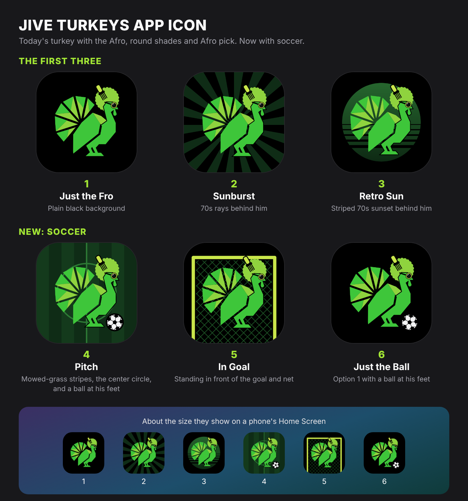
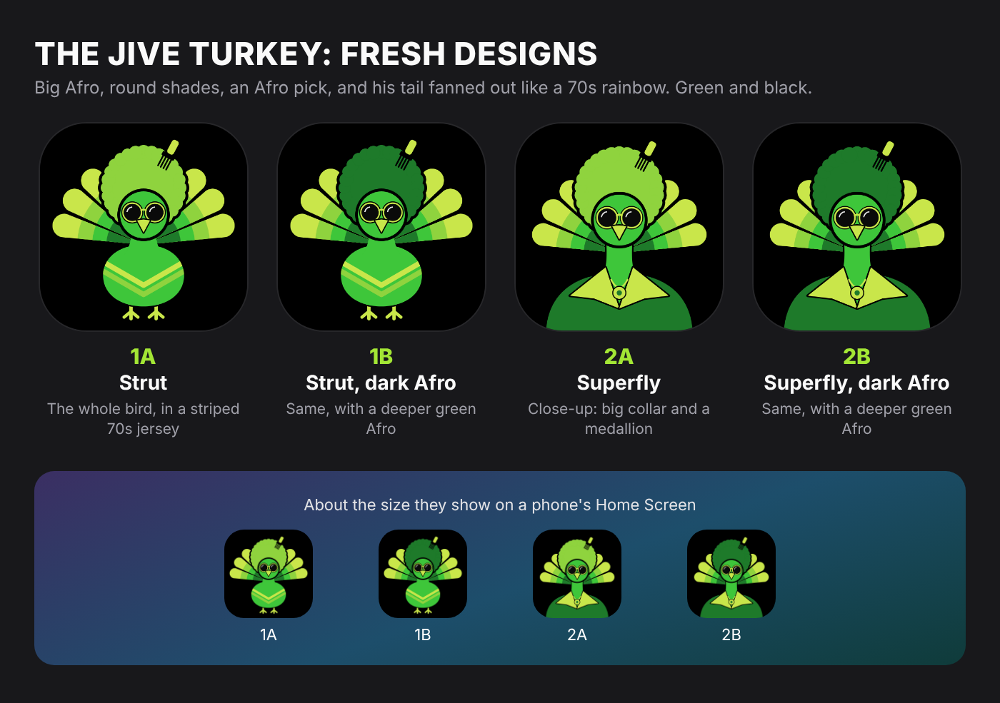
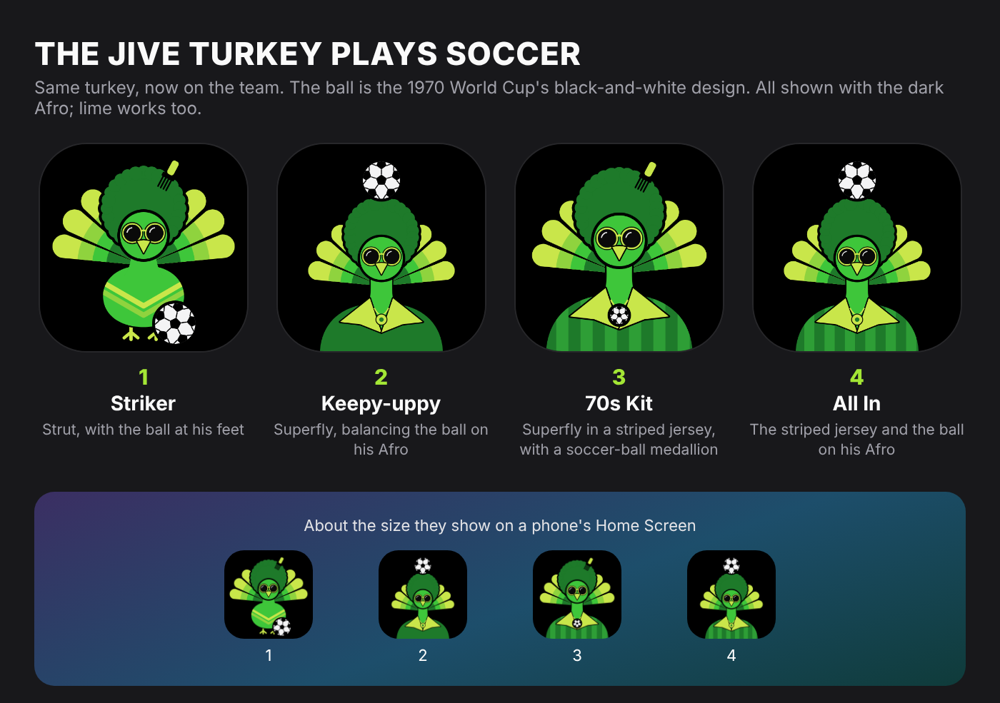

# The Jive Turkey: icon concepts

Ideas for a new logo and app icon for the team: a turkey with a big Afro, round 70s shades and an Afro
pick, in the site's greens on black, with soccer worked in. Saved so they aren't lost. None of them is on
the site yet (it still uses `public/logo.jpg` and the icons made from it).

## The favorite direction: today's turkey with an Afro

The turkey from `public/logo.jpg`, traced into shapes, with the Afro, shades and pick added. Options 1 to 3
came first; 4 to 6 add soccer.



| | Design | What it is |
|---|---|---|
| 1 | [Just the Fro](c1-just-the-fro.svg) | Plain black background |
| 2 | [Sunburst](c2-sunburst.svg) | 70s rays behind him |
| 3 | [Retro Sun](c3-retro-sun.svg) | A striped 70s sunset behind him |
| 4 | [Pitch](c4-pitch.svg) | Mowed-grass stripes, the center circle, and a ball at his feet |
| 5 | [In Goal](c5-in-goal.svg) | Standing in front of the goal and net |
| 6 | [Just the Ball](c6-just-the-ball.svg) | Option 1 with a ball at his feet |

## Also explored: a new front-facing turkey

His tail fans out like a 70s rainbow.



| | Design | What it is |
|---|---|---|
| 1A | [Strut](1a-strut.svg) | The whole bird, in a striped 70s jersey |
| 1B | [Strut, dark Afro](1b-strut-dark-afro.svg) | Same, with a deeper green Afro |
| 2A | [Superfly](2a-superfly.svg) | Close-up, with a big pointed 70s collar and a medallion |
| 2B | [Superfly, dark Afro](2b-superfly-dark-afro.svg) | Same, with a deeper green Afro |

The same turkey playing soccer, with the black-and-white ball style that first appeared at the 1970 World
Cup:



| | Design | What it is |
|---|---|---|
| 1 | [Striker](s1-strut-ball.svg) | Strut, with the ball at his feet |
| 2 | [Keepy-uppy](s2-superfly-keepy.svg) | Superfly, balancing the ball on his Afro |
| 3 | [70s Kit](s3-superfly-kit.svg) | Superfly in a striped 70s soccer jersey, with a soccer-ball medallion |
| 4 | [All In](s4-superfly-kit-keepy.svg) | The striped jersey and the ball on his Afro |

## Editing

Each set of SVGs is drawn by a script next to it, using only the Python standard library:

```bash
python3 docs/design/jive-turkey/classic.py   # today's turkey with an Afro (c1 to c6)
python3 docs/design/jive-turkey/draw.py      # the front-facing turkey (1a to 2b)
python3 docs/design/jive-turkey/soccer.py    # the front-facing soccer versions (s1 to s4)
```

Each rewrites its SVGs. Change the shapes or colors in the scripts rather than editing the SVGs by hand.
The colors are the site's: `#3EC63A` green, `#8FD33E` lime, `#C9E64A` yellow-green and `#1E7A2A` dark
green, on black. The ball is drawn in `soccer.py`; `classic.py` reuses it.
